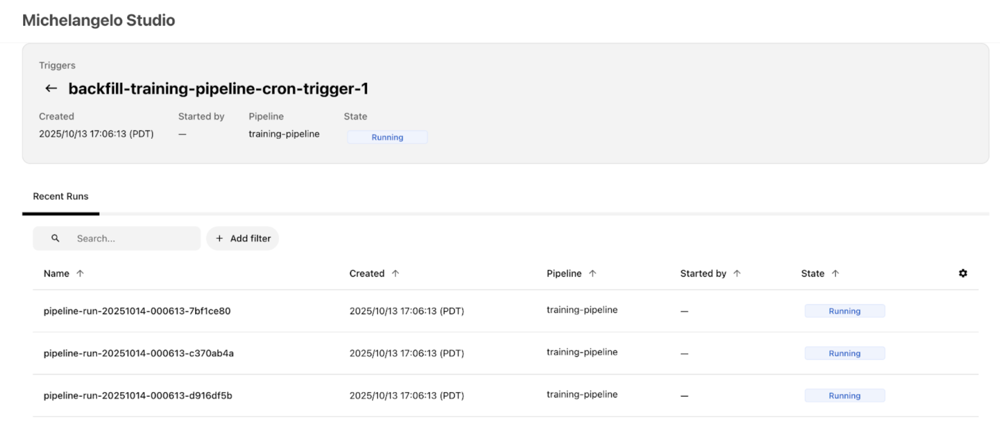
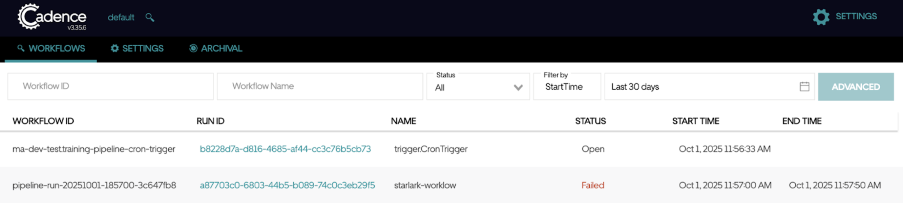
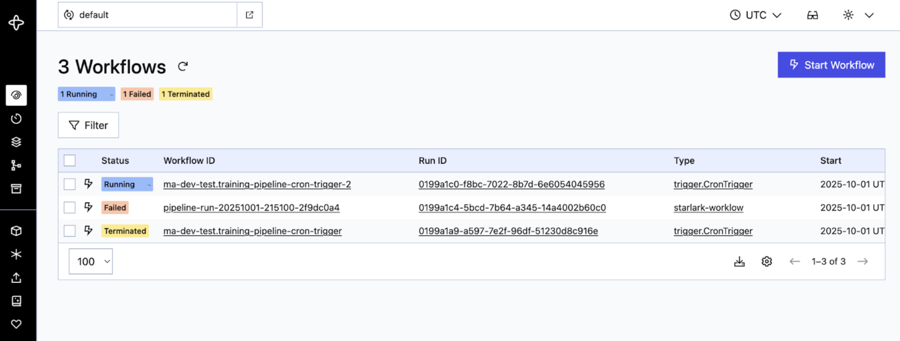

# Set Up Triggers

## What You'll Learn

* How to configure cron-based recurring triggers to run your pipeline on a schedule
* How to configure backfill triggers to reprocess historical time windows
* How to define triggers directly in your pipeline manifest using `trigger_map` for declarative, versionable configuration
* How to create trigger runs from a pipeline's registered trigger configuration using `ma trigger_run create`
* How to monitor your triggers and pipeline runs through the UI

## Prerequisites

Before you get started, make sure you have the following in place:

- **Michelangelo CLI (`ma`) installed** — You'll use the CLI to register and manage your triggers. If you haven't set it up yet, see the [CLI guide](../reference/cli.md) for installation instructions.
- **A running sandbox environment with a project configured** — Triggers run inside a project (set via the `namespace` field in your YAML), so you'll need your sandbox environment up and running. Check out the [Sandbox Setup Guide](../../getting-started/sandbox-setup.md) if you need help with this.
- **A registered pipeline with at least one revision** — Triggers are linked to a specific pipeline revision, so make sure your pipeline is registered before continuing. See [Train and Register a Model](../train-and-deploy-models/train-and-register-a-model.md) for a walkthrough.
- **Access to MA Studio UI** *(optional)* — The Studio UI is handy for monitoring your triggers and pipeline runs, but it's not required to complete the setup.

Once you have these ready, you're all set to create your first trigger!

## Setting Up a Cron Trigger

### 1\. Register the Pipeline with Trigger Configuration

Triggers are defined directly in your pipeline YAML under `spec.manifest.triggerMap`. This keeps trigger configuration declarative and versioned alongside your pipeline definition.

Here's a complete example with a cron trigger:

```yaml
apiVersion: michelangelo.api/v2
kind: Pipeline
metadata:
  name: training-pipeline
  namespace: ml-team                    # Your project name
spec:
  description: Training pipeline with cron trigger
  owner:
    name: your-username
  type: PIPELINE_TYPE_TRAIN
  manifest:
    type: PIPELINE_MANIFEST_TYPE_UNIFLOW
    filePath: examples.my_model.training
    triggerMap:
      daily-training:
        cronSchedule:
          cron: "0 9 * * 1-5"          # Runs at 9:00 AM on weekdays
        maxConcurrency: 3
      nightly-retrain:
        cronSchedule:
          cron: "0 2 * * *"            # Daily at 2 AM
        batchPolicy:
          batchSize: 10                # Runs per batch (default: 10)
          wait: "600s"                 # Pause between batches (default: 600s)
  commit:
    gitRef: "main"
    branch: "main"
```

Register the pipeline with its embedded triggers:

```bash
ma pipeline apply --file=training-pipeline.yaml
```

> **Tip:** The cron expression uses the standard 5-field format: `minute hour day-of-month month day-of-week`. For example, `"0 9 * * 1-5"` means "every weekday at 9 AM." If you're testing and want runs every minute, you can temporarily use `"* * * * *"` — just remember to change it before going to production!

#### Understanding the Trigger Fields

| Field | Description |
| :---- | :---- |
| `cronSchedule.cron` | A standard cron expression that controls the schedule. |
| `maxConcurrency` | Maximum simultaneous pipeline runs. When set above 0, runs execute concurrently. When 0 or omitted, runs execute in sequential batches. |
| `batchPolicy` | Controls batching: `batchSize` sets how many runs per batch (default: 10), and `wait` sets the pause between batches (default: 600 seconds). Ignored when `maxConcurrency` is set above 0. |
| `parametersMap` | Define multiple parameter sets to create separate pipeline runs per cron cycle. See [Parameterized Triggers](#parameterized-triggers). |

Each trigger must specify at least one of `batchPolicy` or `maxConcurrency`. If `batchPolicy` is used, both `batchSize` and `wait` are required. These rules are validated at pipeline registration time.

### 2\. Create a Trigger Run

Once the pipeline is registered, create a TriggerRun from any of the defined triggers:

```bash
ma trigger_run create \
  --namespace=ml-team \
  --pipeline=training-pipeline \
  --trigger-name=daily-training
```

The command fetches the pipeline, extracts the trigger configuration from its `triggerMap`, and creates a TriggerRun CR with a unique name (e.g., `daily-training-a1b2c3d4`).

### 3\. Manage Trigger Runs with the CLI

Here are the commands for managing your trigger runs:

| Action | Command |
| :---- | :---- |
| **Register pipeline with triggers** | `ma pipeline apply --file=<path_to_pipeline.yaml>` |
| **Create trigger run** | `ma trigger_run create --namespace=<ns> --pipeline=<name> --trigger-name=<trigger>` |
| **Check trigger status** | `ma trigger_run get --namespace=<ns> --name=<name>` |
| **Delete a trigger** | `ma trigger_run delete --namespace=<ns> --name=<name>` |
| **Kill a running trigger** | `ma trigger_run kill --namespace=<ns> --name=<name>` |

A few things to keep in mind:

- **`kill` vs `delete`:** Use `kill` to stop a running trigger (it sets a kill flag and cleanly terminates the workflow). Use `delete` to remove the trigger resource entirely.
- **`kill` will ask for confirmation** before proceeding. Add `--yes` to skip the prompt (useful in scripts).

For the full list of CLI options and flags, see the [CLI reference guide](../reference/cli.md).

### 4\. Monitor Your Trigger

Once your trigger is registered, the system starts executing pipeline runs on schedule. You can keep an eye on things through a couple of different UIs.

* **MA Studio UI:** Open your project in MA Studio (in a local sandbox, that's typically `http://localhost:8090/<your-project>`). Look for your trigger under the **Triggers** section — you should see it in a running state with recent pipeline runs listed. Click on a trigger to open its **detail page**, where you can see the **Recent Runs** list, current state, schedule, and configuration.



* **Workflow Engine UI (Cadence/Temporal):** For a deeper look at what's happening under the hood, you can check the workflow engine UI. In a local sandbox, this is typically:
  * **Cadence:** `http://localhost:8088/domains/default`
  * **Temporal:** `http://localhost:8080/domains/default`

  Your trigger shows up as an "Open" or "Running" workflow (look for `trigger.CronTrigger`). This workflow continuously generates **child pipeline runs** based on your cron schedule. You can expand a workflow to see individual activities and their execution times.





## Setting Up a Backfill Trigger

A backfill trigger lets you run your pipeline over a historical time window — for example, reprocessing data from the past week. The setup follows the same steps as a cron trigger, with one addition: you specify a start and end timestamp that defines the time range to backfill.

The system looks at your cron schedule and creates a pipeline run for each cron cycle that falls within that window. Both boundaries are **inclusive**, so if a scheduled time lands exactly on the start or end timestamp, it will still trigger a run.

Here's a complete backfill example:

```yaml
apiVersion: michelangelo.api/v2
kind: TriggerRun
metadata:
  name: training-pipeline-backfill-jan
  namespace: ml-team                    # Your project name
spec:
  pipeline:
    name: training-pipeline
    namespace: ml-team
  revision:
    name: rev-2024-03-01
    namespace: ml-team

  # Define the backfill time window (both boundaries are inclusive)
  start_timestamp: "2024-01-01T09:00:00Z"
  end_timestamp: "2024-01-07T09:00:00Z"

  trigger:
    # The cron schedule determines which timestamps get pipeline runs
    cron_schedule:
      cron: "0 9 * * *"         # Daily at 9:00 AM

    max_concurrency: 2

    batch_policy:
      batch_size: 5
      wait: "600s"

  actor:
    name: "your-username"
```

In this example, the cron schedule is "daily at 9 AM" and the window covers January 1-7. That means the system creates **7 pipeline runs** — one for each day at 9:00 AM. If you also have `parameters_map` entries, the total is multiplied (7 days x 2 parameter sets = 14 runs).

> **Tip:** Make sure your time window actually includes at least one cron cycle. For example, if your cron runs weekly on Saturdays (`"0 9 * * 6"`), a window from Monday to Friday won't generate any runs!

## Advanced Configuration

### Automatic Revision Tracking (auto_flip) — Preview

> **Note:** The `auto_flip` field is available in the YAML schema and UI, but the runtime logic that automatically switches to newer revisions is **not yet active**. For now, please continue pinning your triggers to a specific revision. We're including this section so you know what's coming.

By default, a trigger is pinned to the specific pipeline revision you set in `spec.revision`. Once `auto_flip` is fully active, setting `auto_flip: true` will let your trigger automatically pick up the latest pipeline revision whenever a new one is registered. This is especially useful in production environments — your triggers will automatically get improvements, bug fixes, and updated logic without any manual intervention, reducing operational overhead.

Here's what the configuration will look like:

```yaml
apiVersion: michelangelo.api/v2
kind: TriggerRun
metadata:
  name: training-pipeline-daily-trigger
  namespace: ml-team                    # Your project name
spec:
  pipeline:
    name: training-pipeline
    namespace: ml-team
  revision:
    name: rev-2024-03-01               # Starting revision (will auto-update when feature is active)
    namespace: ml-team

  # Automatically use the latest pipeline revision (preview — not yet active)
  auto_flip: true

  trigger:
    cron_schedule:
      cron: "0 9 * * 1-5"

  actor:
    name: "your-username"
```

#### When to Use auto_flip (Once Active)

| Scenario | Recommendation |
| :---- | :---- |
| Production pipelines that should automatically stay current with the latest code, bug fixes, and improvements | Use `auto_flip: true` |
| Stable production pipelines that should automatically receive platform library updates, security patches, and framework upgrades | Use `auto_flip: true` |
| Teams that want to reduce operational overhead by not manually updating trigger revisions | Use `auto_flip: true` |
| You need reproducible runs tied to a known-good version | Pin to a specific revision (`auto_flip: false` or omit) |
| Changes require approval or review before running in production (compliance, auditing) | Pin to a specific revision |

> **Tip:** Even when `auto_flip` is fully active, you'll still need to provide an initial `spec.revision`. The trigger will start with that revision and switch to newer ones as they become available.

### Parameterized Triggers

If you need to run the same pipeline with different configurations — for example, training separate models for different regions — you can use `parameters_map`. Each entry in the map creates its own pipeline run on every cron cycle.

Here's an example that trains two regional models on every trigger:

```yaml
spec:
  trigger:
    cron_schedule:
      cron: "0 9 * * 1-5"
    parameters_map:
      us_east_model:
        environ:
          REGION: "us-east"
        kw_args:
          learning_rate: 0.01
      eu_west_model:
        environ:
          REGION: "eu-west"
        kw_args:
          learning_rate: 0.005
```

With this setup, every weekday at 9 AM the trigger creates **two pipeline runs** — one for each parameter set.

#### How Parameters Work

Each entry in `parameters_map` is a set of `PipelineExecutionParameters` that gets passed to its own pipeline run. You can configure:

| Field | Description |
| :---- | :---- |
| `environ` | Environment variables passed to the pipeline (key-value pairs) |
| `kw_args` | Keyword arguments passed to your pipeline tasks |
| `args` | Positional arguments (less common, for specialized use cases) |

#### Batching with Parameters

When you have many parameter sets, the `batch_policy` controls how runs are grouped and paced. For example, if you have 50 parameter sets with `batch_size: 10` and `wait: "600s"`, the system creates 5 batches of 10 runs each, pausing 10 minutes between batches.

If you set `max_concurrency` instead, the system ignores `batch_policy` and runs up to that many pipeline runs at the same time.

### Configuring Notifications

You can set up your trigger to send notifications when important events happen — like a pipeline run failing or a trigger completing successfully. Notifications can be sent via **email** or **Slack**, so your team stays informed without having to watch the UI.

Here's an example that sends an email when a pipeline run fails, and a Slack message when the trigger completes successfully:

```yaml
spec:
  notifications:
    # Email alert on pipeline run failure
    - notification_type: NOTIFICATION_TYPE_EMAIL
      event_types: [EVENT_TYPE_PIPELINE_RUN_STATE_FAILED]
      resource_type: RESOURCE_TYPE_TRIGGER_RUN
      emails:
        - "team-alerts@example.com"
        - "your-email@example.com"

    # Slack message on trigger success
    - notification_type: NOTIFICATION_TYPE_SLACK
      event_types: [EVENT_TYPE_TRIGGER_RUN_STATE_SUCCEEDED]
      resource_type: RESOURCE_TYPE_TRIGGER_RUN
      slack_destinations:
        - "#ml-pipeline-alerts"
```

Add the `notifications` block under `spec` in your trigger YAML, alongside your `pipeline`, `revision`, and `trigger` fields.

#### Supported Event Types

You can notify on any combination of these events:

| Event | ID | Description |
| :---- | :---- | :---- |
| Pipeline run succeeded | `EVENT_TYPE_PIPELINE_RUN_STATE_SUCCEEDED` | A pipeline run completed successfully |
| Pipeline run killed | `EVENT_TYPE_PIPELINE_RUN_STATE_KILLED` | A pipeline run was manually terminated |
| Pipeline run failed | `EVENT_TYPE_PIPELINE_RUN_STATE_FAILED` | A pipeline run encountered an error |
| Pipeline run skipped | `EVENT_TYPE_PIPELINE_RUN_STATE_SKIPPED` | A pipeline run was skipped |
| Trigger run killed | `EVENT_TYPE_TRIGGER_RUN_STATE_KILLED` | The trigger itself was terminated |
| Trigger run failed | `EVENT_TYPE_TRIGGER_RUN_STATE_FAILED` | The trigger encountered an error |
| Trigger run succeeded | `EVENT_TYPE_TRIGGER_RUN_STATE_SUCCEEDED` | The trigger completed all scheduled runs |
| Pipeline state ready | `EVENT_TYPE_PIPELINE_STATE_READY` | The pipeline is in a ready state |
| Pipeline state error | `EVENT_TYPE_PIPELINE_STATE_ERROR` | The pipeline has entered an error state |

#### Notification and Resource Types

| Field | Value | Meaning |
| :---- | :---- | :---- |
| `notification_type` | `NOTIFICATION_TYPE_EMAIL` | Email |
| `notification_type` | `NOTIFICATION_TYPE_SLACK` | Slack |
| `resource_type` | `RESOURCE_TYPE_PIPELINE_RUN` | PipelineRun |
| `resource_type` | `RESOURCE_TYPE_TRIGGER_RUN` | TriggerRun |
| `resource_type` | `RESOURCE_TYPE_PIPELINE` | Pipeline |

> **Tip:** A common setup is to notify on failures via email (for immediate attention) and on successes via Slack (for team visibility). You can list multiple `event_types` in a single notification entry to consolidate alerts.

#### Validation Rules

Each trigger in `triggerMap` must satisfy these rules:

- **Execution control required:** Every trigger must specify at least one of `batchPolicy` or `maxConcurrency` to control how pipeline runs are executed.
- **Batch policy completeness:** If `batchPolicy` is specified, both `batchSize` and `wait` must be included.

Validation errors are raised at pipeline registration time, so you'll catch configuration problems early.

## Trigger States

As your trigger runs, it moves through different states. Understanding these states helps you monitor your triggers and troubleshoot any issues.

| State | Description |
| :---- | :---- |
| **RUNNING** | The trigger is active and creating pipeline runs on schedule. This is the normal operating state. |
| **SUCCEEDED** | The trigger completed all its scheduled runs successfully. For backfill triggers, this means the entire time window has been processed. |
| **FAILED** | Something went wrong and the trigger couldn't complete. Check the trigger details for error information. |
| **KILLED** | The trigger was manually stopped using `ma trigger_run kill`. |
| **PENDING_KILL** | A kill request has been sent but the trigger hasn't fully stopped yet. It will transition to KILLED shortly. |
| **INVALID** | The trigger configuration has a problem — for example, a missing pipeline or revision. Review your pipeline YAML's `triggerMap` for errors. |

### How States Transition

Here's the typical flow:

1. When you register a trigger, it enters the **RUNNING** state and begins creating pipeline runs.
2. If everything goes well, a backfill trigger moves to **SUCCEEDED** when it finishes. Cron triggers stay in **RUNNING** until stopped.
3. If you run `ma trigger_run kill`, the trigger moves to **PENDING_KILL** and then to **KILLED**.
4. If an error occurs, the trigger moves to **FAILED**.

### Checking Your Trigger's State

You can check the current state of any trigger with the CLI:

```bash
ma trigger_run get --namespace=<ns> --name=<name>
```

The output includes the trigger's current state, recent pipeline runs, and any error details. You can also see trigger states in the MA Studio UI under the **Triggers** section of your project.

## Troubleshooting

Running into issues? Here are a few common things to check:

- **Trigger not starting?** Make sure your pipeline is registered and the trigger name matches one defined in the pipeline's `triggerMap`. You can verify with `ma trigger_run get --namespace=<ns> --name=<name>`.
- **CLI command failing?** Double-check that your sandbox is running and your project exists. See the [Prerequisites](#prerequisites) section above.
- **Cron not firing when you expect?** Verify your cron expression is correct — the 5-field format can be tricky. [crontab.guru](https://crontab.guru/) is a handy tool for testing expressions.
- **Pipeline runs not showing up in the UI?** Check the trigger state with `ma trigger_run get`. If the trigger is in a `FAILED` or `INVALID` state, the output will include details about what went wrong.

## Coming Soon

We're working on additional trigger types to give you even more flexibility:

- **Interval Schedule** — Trigger pipeline runs at a fixed time interval (for example, every 2 hours) instead of using cron expressions. Great for simple, recurring schedules.
- **Batch Rerun** — Rerun a set of failed pipeline runs in bulk, with the option to resume from a specific point in the pipeline DAG. Useful for recovering from transient failures without reprocessing everything.

These features are defined in the system but not yet fully available. Stay tuned for updates!

## What's Next

Now that your triggers are set up, here are some useful next steps:

- Dive deeper into [ML Pipelines](./index.md) to learn about the pipeline framework your triggers are running
- Learn about different [Pipeline Running Modes](./pipeline-running-modes.md) to understand how your pipelines execute
- Explore [Caching and Pipeline Resume](./cache-and-pipelinerun-resume-form.md) to speed up repeated runs
- Check out the full [CLI Reference](../reference/cli.md) for additional trigger management commands